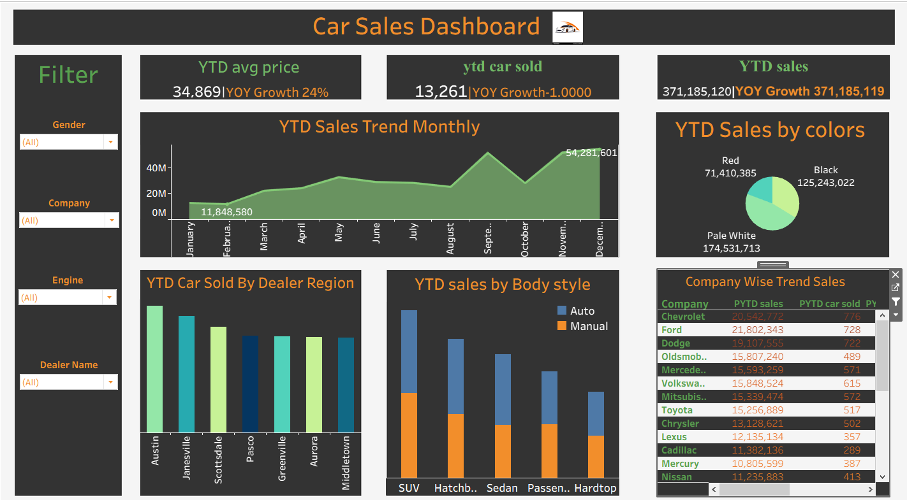

# 🚗 Car Sales Dashboard (Tableau)

This project presents a **Car Sales Dashboard** built using **Tableau** to visualize and analyze year-to-date (YTD) performance of car sales.  
It helps monitor key metrics such as total sales, cars sold, average price, and year-over-year (YOY) growth across different dimensions including **color, company, region, and body style**.

---

## 📊 Dashboard Overview

The interactive dashboard provides a comprehensive view of car sales performance:

- **YTD Average Price & YOY Growth:** Displays average selling price and yearly growth trends.  
- **YTD Sales Trend (Monthly):** Line chart showing monthly sales progression and seasonality.  
- **YTD Sales by Colors:** Pie chart comparing sales distribution among car colors (Red, Black, Pale White).  
- **YTD Car Sold by Dealer Region:** Highlights which regions achieved the highest sales volume.  
- **YTD Sales by Body Style:** Stacked bar chart comparing Auto vs Manual sales across car types.  
- **Company-wise Trend Sales:** Shows detailed performance by car company, including total sales and units sold.  

📸 *Dashboard Preview:*  

---

## 🧠 Key Insights

- **Pale White** cars achieved the highest total sales, followed by **Black** and **Red**.  
- **SUVs** and **Sedans** dominate in total units sold.  
- **Austin** region recorded the highest car sales.  
- **Chevrolet** and **Ford** are leading companies in overall performance.  
- The overall **YTD growth trend** indicates a positive performance in both revenue and sales volume.

---

## 🛠️ Tools Used
- **Tableau Public**  
  - Interactive Filters  
  - KPI Cards for YTD Metrics  
  - Dual-Axis and Combined Charts  
  - Color-Coded Visuals for Comparison  

 

---

## 🌐 Live Dashboard 
You can view the interactive dashboard on **[Tableau Public](#)**  

---

## 👩‍💻 Author
**Hana Wael**  
Data Analyst | Tableau • Excel • SQL • Python

